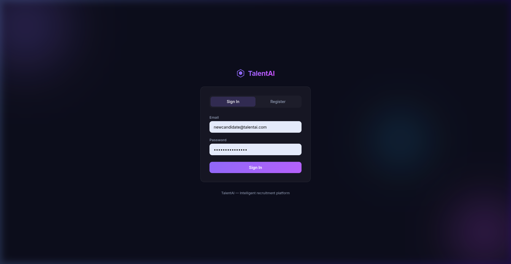
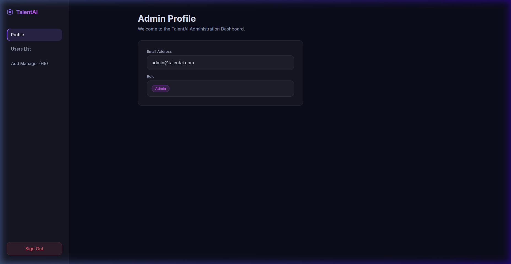
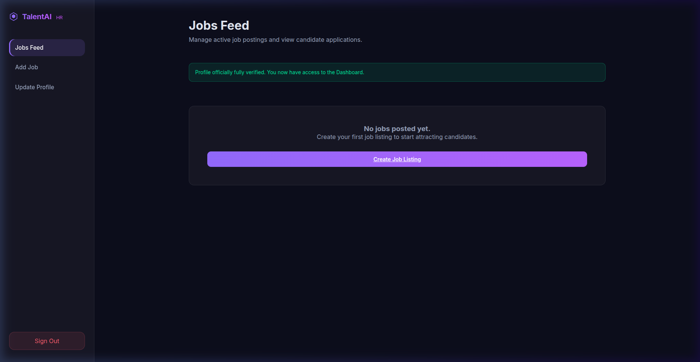
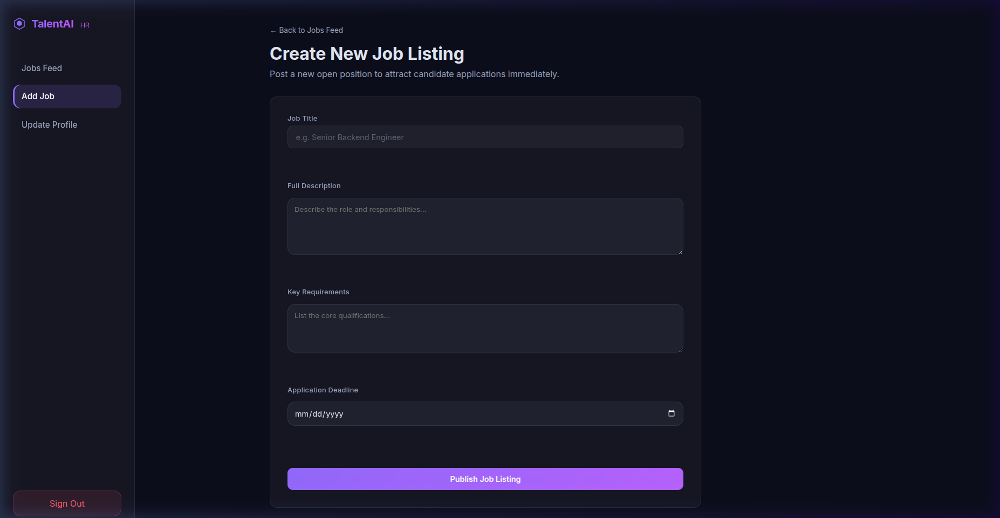

<p align="center">
  
</p>

<h1 align="center">TalentAI — AI-Powered Recruitment & ATS Platform</h1>

<p align="center">
  <em>An intelligent recruitment platform combining Resume Parsing, ATS Scoring, and AI Matching — built for modern hiring workflows.</em>
</p>

<p align="center">
  
  
  
  
  
</p>

---

## 👨‍💻 Author

**Fadi Mriri** — Cloud & DevOps Engineer

📍 Tunis, Tunisia
📧 [fmriri2@gmail.com](mailto:fmriri2@gmail.com)

[](https://linkedin.com/in/fadi-mriri)
[](https://github.com/fedimriri)
[](https://fadimriri-portfolio.vercel.app)

---

## 🚀 Overview

TalentAI is an **end-to-end AI-powered recruitment platform** designed to automate and enhance the hiring pipeline:

- **Parse resumes** into structured candidate profiles (skills, experience, education)
- **Analyze job descriptions** to extract requirements automatically
- **Score candidates** with an ATS engine across multiple dimensions
- **Match candidates to jobs** using AI-driven semantic analysis
- **Streamline HR workflows** with role-based dashboards and email notifications

---

## ✨ Features

### 🎯 Candidate Side
- Resume Upload & Parsing (PDF / DOCX)
- ATS Score Simulation
- Resume Editing & Profile Management
- Job Application Tracking

### 📋 HR Side
- Job Posting & Management
- Candidate Ranking (ATS + AI Score)
- Application Status Management (Approve / Reject / Shortlist)
- Secure Resume Viewing
- Filtering by Skills, Score & Experience

### 🧠 AI & Core Engine
| Phase | Module | Description |
|-------|--------|-------------|
| 3.1 | **Resume Parser** | Extracts skills, experience ranges, education from raw documents |
| 3.2 | **Job Description Analyzer** | Identifies required skills, experience years, qualifications |
| 3.3 | **Matching Algorithm** | Multi-dimensional scoring across skills, experience, education |
| 3.4 | **ATS Scoring** | Weighted composite score with detailed breakdown |
| 3.5 | **AI Semantic Matching** | Groq API (LLaMA) for intelligent context-aware matching |

---

## 🏗️ Architecture

```
┌─────────────────────────────────────────────────────────────────┐
│                        ASP.NET Core MVC                         │
│                     (Controllers + Views)                       │
├─────────────┬───────────────┬───────────────┬───────────────────┤
│  Auth       │  Admin        │  HR           │  Candidate        │
│  Controller │  Controller   │  Controller   │  Controller       │
├─────────────┴───────────────┴───────────────┴───────────────────┤
│                        Services Layer                           │
├──────────┬──────────┬──────────┬──────────┬─────────────────────┤
│ Resume   │ Job      │ ATS      │ Matching │ Email               │
│ Parser   │ Parser   │ Scoring  │ Service  │ Service             │
├──────────┴──────────┴──────────┴──────────┴─────────────────────┤
│                     AI Integration (Groq API)                   │
├─────────────────────────────────────────────────────────────────┤
│                MongoDB (NoSQL Data Layer)                        │
└─────────────────────────────────────────────────────────────────┘
```

---

## 🛠️ Tech Stack

| Category | Technology |
|----------|-----------|
| **Backend** | ASP.NET Core MVC (.NET 10) |
| **Database** | MongoDB |
| **AI** | Groq API (LLaMA models) |
| **PDF Parsing** | PdfPig |
| **DOCX Parsing** | OpenXML SDK |
| **Email** | Gmail SMTP via MailKit |
| **Containerization** | Docker & Docker Compose |
| **DevOps** | CI/CD Ready, Multi-stage Docker Build |

---

## 📸 Screenshots

<details>
<summary><strong>🔐 Login Page</strong></summary>
<br/>

</details>

<details>
<summary><strong>🛡️ Admin Dashboard</strong></summary>
<br/>

</details>

<details>
<summary><strong>📋 HR Dashboard — Jobs Feed</strong></summary>
<br/>

</details>

<details>
<summary><strong>📝 Create Job Listing</strong></summary>
<br/>

</details>

---

## ⚙️ Installation

### Prerequisites

- [.NET 10 SDK](https://dotnet.microsoft.com/download)
- MongoDB (local or containerized)
- Docker *(optional)*

### Run Locally

```bash
# Clone the repository
git clone https://github.com/fedimriri/TalentAI.git
cd TalentAI

# Restore dependencies
dotnet restore

# Run the application
dotnet run
```

App available at: **http://localhost:5000**

---

## 🐳 Run with Docker

```bash
# Build the image
docker build -t talentai .

# Run the container
docker run -p 5000:5000 talentai
```

**Using Docker Compose** (connects to external MongoDB):

```bash
docker compose up --build
```

> **Note:** If your MongoDB runs in a separate compose project, TalentAI automatically joins the external `mongo_default` network to connect.

---

## 🔐 Default Admin

On first startup, the app auto-seeds an admin account:

| Field | Value |
|-------|-------|
| Email | `admin@talentai.com` |
| Password | `admin123` |
| Role | Admin |

> ⚠️ **Change these credentials in production.**

---

## ⚙️ Configuration

All settings are in `appsettings.json`:

| Section | Purpose | Key Values |
|---------|---------|------------|
| `MongoSettings` | Database connection | `ConnectionString`, `DatabaseName` |
| `AISettings` | AI integration | `GroqApiKey` |
| `EmailSettings` | SMTP notifications | `Host`, `Port`, `Username`, `Password`, `FromEmail` |

### SMTP (Gmail)
The app sends branded HTML emails for:
- HR account creation (purple theme)
- Application approved (green theme)
- Application rejected (red theme)
- Application under review (blue theme)

---

## 📁 Project Structure

```
TalentAI/
├── Configurations/       # Settings: Mongo, Email, AI
├── Controllers/          # MVC: Auth, Admin, HR, Candidate
├── Data/                 # MongoDbContext
├── DTOs/                 # Data Transfer Objects
├── Models/               # User, Job, JobApplication
├── Services/             # Core Business Logic
│   ├── ResumeParserService.cs
│   ├── JobParserService.cs
│   ├── MatchingService.cs
│   ├── AtsScoringService.cs
│   ├── EmailService.cs
│   └── EmailTemplateBuilder.cs
├── Views/                # Razor Views (dark-theme UI)
├── wwwroot/              # Static files & uploads
├── Dockerfile            # Multi-stage production build
├── compose.yaml          # Docker Compose config
└── Program.cs            # Entry point & DI setup
```

---

## 📄 License

MIT License © 2026 **Fadi Mriri**

---

## 🤝 Contributing

Contributions are welcome! Please follow these guidelines:

1. **Do not** push directly to `main`
2. Create a feature branch: `git checkout -b feature/your-feature`
3. Submit a Pull Request with a clear description

---

<p align="center">
  <strong>Built with a strong focus on DevOps, scalability, and AI-driven recruitment systems.</strong>
</p>

<p align="center">
  <sub>⭐ Star this repo if you find it useful!</sub>
</p>
